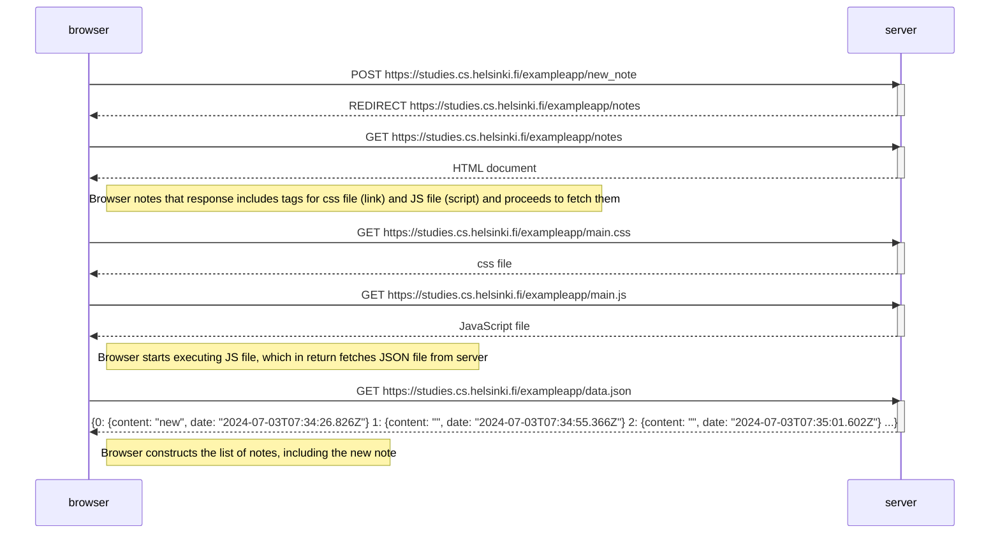

```mermaid
sequenceDiagram
	participant browser
	participant server

	browser->>server: POST https://studies.cs.helsinki.fi/exampleapp/new_note
	activate server
	server-->>browser: REDIRECT https://studies.cs.helsinki.fi/exampleapp/notes
	deactivate server
  
	browser->>server: GET https://studies.cs.helsinki.fi/exampleapp/notes
	activate server
	server-->>browser: HTML document
	deactivate server

	Note right of browser: Browser notes that response includes tags for css file (link) and JS file (script) and proceeds to fetch them 

	browser->>server: GET https://studies.cs.helsinki.fi/exampleapp/main.css
	activate server
	server-->>browser: css file
	deactivate server

	browser->>server: GET https://studies.cs.helsinki.fi/exampleapp/main.js
	activate server
	server-->>browser: JavaScript file
	deactivate server

	Note right of browser: Browser starts executing JS file, which in return fetches JSON file from server
	
	browser->>server: GET https://studies.cs.helsinki.fi/exampleapp/data.json
	activate server
	server-->>browser: {0: {content: "new", date: "2024-07-03T07:34:26.826Z"} 1: {content: "", date: "2024-07-03T07:34:55.366Z"} 2: {content: "", date: "2024-07-03T07:35:01.602Z"} ...}
	deactivate server
        Note right of browser: Browser constructs the list of notes, including the new note
```
