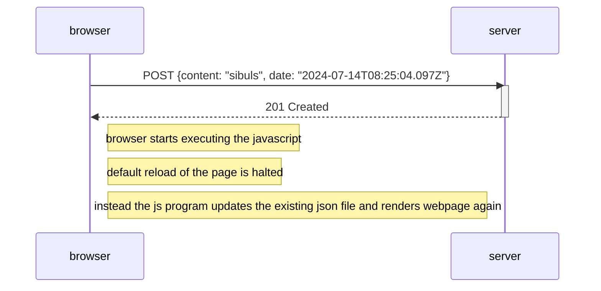

```mermaid
sequenceDiagram
  participant browser
  participant server

  browser->>server: POST {content: "sibuls", date: "2024-07-14T08:25:04.097Z"}
  activate server
  server-->>browser: 201 Created
  deactivate server
  note right of browser: browser starts executing the javascript
  note right of browser: default reload of the page is halted
  note right of browser: instead the js program updates the existing json file and renders webpage again
```
